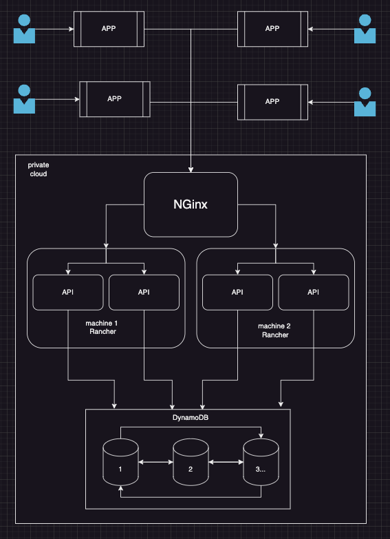

# Concept to prove:

1. What was done
    1. Created docker-compose file with different containers (aka "machines")
        1. 2 containers running kubernetes (used rancher here because it's the only one with docker support), they will
           contain the deployed applications (rancher1 and rancher2)
        2. 1 container running a load balancer to balance the load between the two kubernetes, turning the two
           kubernetes instances into 1 for the client (nginx)
        3. 1 container to run DB (DynamoDB) 
        4. 1 container to run commands to deploy/wire everything, the commands are stored inside the
           ./build/rancher/entrypoint.sh file, basically it awaits the ranchers to finish initialization and run a chain
           of commands to deploy, expose and scale the pods (rancher-cli)
    2. The api is available at http://localhost:8080 (exposed by nginx container)
    3. The application containers deployed can be seen at https://localhost:441 (exposed by rancher1)
       and https://localhost:442 (exposed by rancher2)
        1. The username and password to access the rancher clusters is admin/password respectively
        2. When connected the pods can be visualized at https://localhost:<port>/dashboard/c/local/explorer/pod
        3. They can also be scaled up/down at https://localhost:<port>
           /dashboard/c/local/explorer/apps.deployment/default/static-site#pods
2. Pre-requisites:
    1. Have docker and docker-compose installed
3. How to run it:
    1. Start
        1. docker-compose -f build/docker-compose.yaml up
    2. Stop
        1. docker-compose -f build/docker-compose.yaml down --volumes
